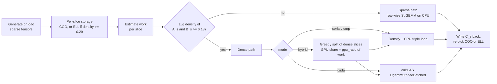

# tensor-facewise

Face-wise (slice-by-slice) products and slice-wise QR/SVD of sparse
third-order tensors, with four interchangeable backends: serial,
OpenMP, CUDA (cuBLAS) and a concurrent CPU+GPU hybrid. Each frontal
slice is stored as COO, or as ELL when it is dense enough, and is sent
down a sparse or dense compute path according to its density.

Course project, Tensor Computations for Data Science, M.Tech CDS, IISc, 2026.

## Problem

Given `A` of size `m x k x p` and `B` of size `k x n x p`, the face-wise
product is

```
C(:, :, s) = A(:, :, s) * B(:, :, s)      for s = 1..p
```

It is the inner step of the t-product family of tensor operations
(applied in a transform domain) and of slice-wise factorizations. Real
tensors are often very sparse, and the slices of one tensor can differ
widely in density. A single kernel on a single device is then the wrong
choice for some slices: a sparse kernel wastes time on dense slices,
and a dense GPU GEMM wastes memory and bandwidth on sparse ones.

The code also computes a QR and an SVD of every frontal slice.

Naming note: the command line calls the product `--operation hadamard`
(a name kept from early in the project). It is a matrix product per
frontal slice, not an element-wise product.

## Approach



- **Storage** (`include/tensor.hpp`): every slice keeps a COO copy;
  slices with density >= 0.20 also get an ELL copy (rows padded to the
  widest row) and use it as their preferred format.
- **Path selection** (`include/sparse_ops.hpp`): a slice pair goes to the
  dense path when the average density of the two operands is >= 0.18,
  otherwise to a row-wise sparse product (Gustavson's formulation, with
  a `std::map` accumulator per output row).
- **OpenMP**: slices are sorted by estimated work, largest first, and
  distributed with `schedule(runtime)` set to dynamic. The chunk size is
  `depth / (2 * threads)`, clamped to 1..64, unless given with
  `--omp-chunk`. Per-thread work and time are recorded to measure
  imbalance.
- **CUDA** (`src/cuda_kernels.cu`): dense slices are packed into batches
  of about 512 MiB, copied to the device and multiplied with
  `cublasDgemmStridedBatched` (row-major `C = A B` computed as
  column-major `C^T = B^T A^T`). Sparse slices stay on the CPU and run
  with OpenMP.
- **Hybrid** (`include/hybrid_ops.hpp`): sparse slices always go to the
  CPU. The dense ones are split greedily, heaviest first, so that the
  GPU's share of the estimated work is close to `--gpu-ratio`. The CPU
  part and the GPU part run at the same time through `std::async`, and
  the results are written back by slice index.
- **QR / SVD** (`include/dense.hpp`): classical Gram-Schmidt QR; SVD
  through a Jacobi eigen-decomposition of `A^T A`, with `U = A V / sigma`.
  Slices are processed in parallel with OpenMP.

More diagrams are in [`docs/diagrams/`](docs/diagrams/).

## Results

**Hardware.** All runs used one node of a teaching cluster: an Intel
Xeon Platinum 8352V (36 cores, 72 hardware threads), about 128 GB of
RAM and one NVIDIA RTX A5000 (24 GB). The CUDA toolkit was 12.x. Jobs
asked SLURM for 36 CPUs and 1 GPU with exclusive node access.

Every number below is copied from a CSV in [`results/`](results/).
Each configuration was measured once.

### OpenMP and hybrid scaling (99% sparse)

From `results/scalability_matrix.csv`, for square tensors of
5000 x 5000 x 100 at 1% density:

| mode   | threads | time_sec | speedup_vs_serial |
|--------|--------:|---------:|------------------:|
| serial | 1       | 1832.26  | 1.00              |
| cuda   | 1       | 1846.56  | 0.99              |
| omp    | 36      | 103.139  | 17.76             |
| hybrid | 36      | 103.241  | 17.75             |
| omp    | 64      | 99.0383  | 18.50             |
| hybrid | 64      | 98.21    | **18.66** (18.6565522859) |
| omp    | 72      | 102.379  | 17.90             |

The best result for each shape class (`results/summary/best_speedup_by_shape_mode.csv`):
square 18.66x (hybrid, 64 threads, 5000x5000x100), tall 17.95x (omp,
36 threads, 6250x5000x100), wide 16.86x (hybrid, 72 threads,
3500x4375x70).

How to read these numbers:

- At 1% density every slice takes the sparse path (`dense_slices = 0`
  in all of these rows). The hybrid mode then has nothing to send to the
  GPU and runs the OpenMP code, so "hybrid" and "omp" measure the same
  thing here. The GPU was not used.
- 64 and 72 threads are more threads than the 36 cores allocated. On
  the 36 allocated cores the speedup is 17.76x, a parallel efficiency
  of about 49%.

### Dense slices: CUDA vs serial

Dense 4000 x 4000 x 12 tensors (`results/bottleneck_metrics.csv`, case
`case2_dense_compare`):

| measurement | serial | CUDA | ratio |
|-------------|-------:|-----:|------:|
| wall clock of the whole job step (CSV `time_sec`) | 2992.53 s | 807.65 s | 3.71x (CSV: 3.7052) |
| one measured product pass, as printed by the binary (`results/inbinary_timing_profile_cases.csv`) | 745.26 s | 16.61 s | 44.9x |

The 3.71x figure is end-to-end: the wall clock covers two warm-up
passes and the measured pass. It also includes about 757 s that both
runs spend generating and preprocessing the dense synthetic tensors on
a single thread. That is the wall clock minus the binary's own
`time_sec`: 2992.53 minus 2235.78 for serial, 807.65 minus 49.87 for
CUDA. The pass-level ratio
is much larger, but its serial baseline is a plain triple loop with no
blocking and no BLAS. It shows what the GPU path gains over this
code, not what cuBLAS gains over a tuned CPU GEMM.

### Storage

Every row of `results/scalability_matrix.csv` (all at 1% density) has
`input_compression_dense_to_coo = 33.3333`: COO takes 33x less memory
than dense storage. This follows from the layout: a dense entry is 8
bytes, a COO nonzero is 24 bytes (two 8-byte indices and an 8-byte
value), and 8 / (0.01 x 24) = 33.3.

ELL needs only 12 bytes per slot (a 4-byte column index and an 8-byte
value) but pads every row to the longest one. Its compression ranges
from 14.3x on the smallest tensors, where 21% of slots are used, to
43.0x on the largest, where 64% are used. Per-shape averages are in
`results/summary/storage_compression.csv`. At 1% density the format
chooser always picks COO (its ELL cut-off is a density of 0.20), even
on the large tensors where ELL would take less memory. The cut-off is
tuned for compute, not memory.

### Other profiling cases (`results/bottleneck_metrics.csv`)

| case | setting | result |
|------|---------|--------|
| 2000 x 2000 x 20, 99.5% sparse, OpenMP | 1 -> 32 threads | 4.303 s -> 0.743 s (5.8x) |
| 8000 x 8000 x 24, 99.9% sparse, OpenMP | 1 -> 32 threads | 14.397 s -> 2.227 s (6.5x) |
| 6000 x 6000 x 16, 99% sparse, hybrid | gpu_ratio 0.3 / 0.5 / 0.7 | 71.13 / 70.52 / 70.42 s |

These times are wall clock and include tensor generation, which keeps
the speedups lower than in the sweep. The GPU-ratio scan is flat because
all 16 slices are below the dense threshold, so the GPU was assigned 0
slices at every ratio (`results/inbinary_timing_profile_cases.csv`).

### How many runs

The CSVs hold **488 timed runs**: 389 in the scalability sweep, 80 in
the debug matrix (`correctness_results.csv`) and 19 profiling runs
(`bottleneck_metrics.csv`). The sweep was planned as 21 tensor shapes x
20 configurations = 420 runs. It stopped after 389, when the OpenMP run
at 64 threads on the tall 6250 x 5000 x 100 shape was killed (the job
log reports the task as `Killed`, most likely from running out of
memory). The rest of that shape and the whole wide 5000 x 6250 x 100
shape are missing.

## Correctness

- **On the cluster** (`scripts/slurm_debug.sh`): the face-wise product
  outputs of omp, cuda and hybrid were compared element-wise against
  the serial output with `scripts/compare_tensors.py`. The absolute
  tolerance was 1e-8 for the 50 x 50 x 3 cases and 1e-6 for the
  1000 x 1000 x 10 cases, with a 1e-3 relative fallback. Two serial runs
  of the same input matched exactly: 879 entries, maximum difference 0
  (`results/summary/determinism_stats.csv`). The job reported 141 checks
  passed and 0 failed (`results/debug_job_summary.txt`).
- **Added after the course** (`make check`): the cluster tests only
  compare modes with each other, so a bug in the shared code would pass.
  `scripts/reference_check.py` writes random sparse inputs, computes the
  face-wise product in plain Python, and checks all four modes against
  it. It covers a sparse case, two dense cases and rectangular slices.
  On a CPU-only build (Ubuntu 24.04, g++ 13.3) every mode matches with a
  maximum absolute error of 4.4e-16. In a CPU-only build the `cuda` and
  `hybrid` modes run their partitioning code, with the serial kernel
  standing in for the GPU.
- The QR and SVD checks only confirm that each run completes. Their
  factors are not compared numerically (see Limitations).

## Build and run

Requirements: g++ with C++17 and OpenMP. For the GPU build you also
need `nvcc` and cuBLAS. Python 3 runs the checks; `make report-assets`
also needs numpy, pandas and matplotlib.

```bash
make cpu            # tensor_app_cpu (g++ -fopenmp)
make check          # all modes vs a pure-Python reference
make cuda           # tensor_app_cuda (nvcc + cuBLAS)

# 99% sparse face-wise product with 16 OpenMP threads
OMP_NUM_THREADS=16 ./tensor_app_cpu --mode omp --operation hadamard \
    --rows-a 2000 --cols-a 2000 --rows-b 2000 --cols-b 2000 --depth 20 \
    --density-a 0.01 --density-b 0.01 --warmup 0 --timing-only

# dense slices split between GPU and CPU, 70% of the dense work on the GPU
./tensor_app_cuda --mode hybrid --gpu-ratio 0.7 --operation hadamard \
    --rows-a 1024 --cols-a 1024 --rows-b 1024 --cols-b 1024 --depth 32 \
    --density-a 1.0 --density-b 1.0 --timing-only
```

Main options: `--mode serial|omp|cuda|hybrid`,
`--operation hadamard|qr|svd`, `--rows-a/--cols-a/--rows-b/--cols-b/--depth`,
`--density-a/--density-b`, `--seed`, `--input-a/--input-b` (CSV of
`slice,row,col,value`), `--gpu-ratio`, `--preprocess-threshold` (ELL
cut-off), `--omp-chunk`, `--warmup`, `--out`, `--timing-only`. Run
`./tensor_app_cpu --help` for the full list.

On a SLURM cluster, submit from the repository root. The `#SBATCH`
headers contain placeholders, and options given on the command line
override them:

```bash
sbatch --partition=<partition> --account=<account> scripts/slurm_debug.sh    # correctness
sbatch --partition=<partition> --account=<account> scripts/slurm_run.sh      # scalability sweep
sbatch --partition=<partition> --account=<account> scripts/slurm_profile.sh  # profiling cases
make report-assets   # figures and tables from artifacts/
```

The jobs write to `artifacts/`, which is git-ignored. The snapshot from
the original runs is in `results/`.

## Limitations

- **The GPU only handles dense slices.** There is no sparse GPU kernel,
  so sparse slices always run on the CPU. In the 99% sparse sweep the
  GPU did no work, and "hybrid" was the OpenMP code. A cuSPARSE SpGEMM
  path would be the next step.
- **QR and SVD do not use the GPU.** In `cuda` mode they call the serial
  CPU code; `hybrid` mode splits slices between that code and OpenMP.
  Their correctness is not checked numerically.
- **The factorizations are textbook versions.** Classical Gram-Schmidt
  loses orthogonality on ill-conditioned slices, and forming `A^T A`
  squares the condition number. Householder QR and one-sided Jacobi SVD
  would fix both.
- **Timing caveats.** The binary starts its timer before the warm-up
  passes, so `time_sec` in the sweep covers one warm-up pass plus the
  measured pass. Every mode is timed the same way, so speedups are not
  affected, but absolute times are about twice a single pass. The
  profiling CSV uses wall-clock time, which includes data generation.
  Each configuration ran once, so there are no error bars.
- **The dense CPU path is naive** (a triple loop with bounds-checked
  element access), which makes it a weak baseline for the CUDA
  comparison.
- **The sparse kernel uses a `std::map` accumulator per output row.**
  This does many small allocations; a dense or hashed accumulator would
  be faster. Scaling levels off beyond about 32 threads.
- **No copy/compute overlap on the GPU.** It uses one stream, pageable
  host buffers and a synchronize after every batch.
- **COO indices are 64-bit.** With 32-bit indices a nonzero would take
  16 bytes instead of 24, and the compression at 1% density would be 50x
  instead of 33.3x.
- **The sweep is incomplete** (389 of 420 runs, see above), and
  everything runs on a single node; there is no MPI.

## Repository layout

```
include/   tensor types, COO/ELL storage, sparse/dense/hybrid operations
src/       main.cpp (CLI, timing, metrics), cuda_kernels.cu (cuBLAS path)
scripts/   SLURM jobs, compare_tensors.py, reference_check.py,
           generate_report_assets.py
results/   CSV snapshot of the cluster runs (+ summary/ tables)
docs/      Mermaid diagrams
```

## References

- T. G. Kolda and B. W. Bader, "Tensor Decompositions and Applications,"
  SIAM Review 51(3), 455-500, 2009.
- M. E. Kilmer and C. D. Martin, "Factorization strategies for
  third-order tensors," Linear Algebra and its Applications 435(3),
  641-658, 2011.
- E. Kernfeld, M. Kilmer and S. Aeron, "Tensor-tensor products with
  invertible linear transforms," Linear Algebra and its Applications
  485, 545-570, 2015.
- F. G. Gustavson, "Two fast algorithms for sparse matrices:
  multiplication and permuted transposition," ACM Transactions on
  Mathematical Software 4(3), 250-269, 1978.
- N. Bell and M. Garland, "Implementing sparse matrix-vector
  multiplication on throughput-oriented processors," SC '09, 2009
  (COO and ELL formats).
- G. H. Golub and C. F. Van Loan, *Matrix Computations*, 4th ed., Johns
  Hopkins University Press, 2013 (Gram-Schmidt, Jacobi eigenvalue method).
- NVIDIA, cuBLAS Library documentation, `cublas<t>gemmStridedBatched`.

## License

MIT, see [LICENSE](LICENSE).
